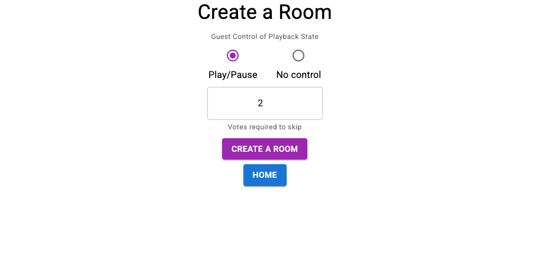

# House Party

A web app for hosting a shared music session: one person creates a room, others
join with a code, and the room's settings decide who can control playback. Built
with a **Django + Django REST Framework** backend and a **React** single-page
frontend, following the "Web Development with Django and React" approach.

> ⚠️ Early stage. Room creation and joining work; live music-service playback is not wired up yet.


*The "Create a Room" screen: set who can control playback and how many votes skip a track.*

## Quickstart

Two processes: Django serves the app and the API, webpack builds the React bundle.

```bash
git clone https://github.com/simar-s2/House-Party.git
cd House-Party

# 1. Backend
python -m venv venv
source venv/bin/activate          # Windows: venv\Scripts\activate
pip install -r requirements.txt
cd music_controller
python manage.py migrate

# 2. Frontend bundle (second terminal, from music_controller/frontend)
cd music_controller/frontend
npm install
npm run dev                        # webpack --watch; use `npm run build` for a one-off

# 3. Run the server (first terminal, from music_controller)
python manage.py runserver
```

Open http://127.0.0.1:8000.

## How it works

**The frontend is one page.** `frontend/views.py` renders a single template for
`/`, `/join`, `/create`, and `/room/<code>`; React Router then decides what to show
based on the URL. `App.js` mounts into `<div id="app">`, webpack compiles `src/`
into `static/frontend/main.js`, and Django serves that as a static file.

**The backend is a small REST API** (`api/` app):

| Method and route | Purpose |
|---|---|
| `GET /api/room` | list rooms |
| `POST /api/create-room` | create a room, or update the caller's existing one |

**Rooms and identity.** A `Room` has an auto-generated unique 6-letter `code`, a
`host`, and two policy fields: `guest_can_pause` and `votes_to_skip`. The host is
identified by the browser's **Django session key**; there are no user accounts. On
`create-room`, if a room already exists for that session it's updated in place
rather than duplicated.

## What it does

- Create a room and set guest permissions (`guest_can_pause`, `votes_to_skip`)
- Get a shareable room code
- Join an existing room by code
- Re-opening the create form for a room you already host edits it instead of making a new one

## Built with

Django · Django REST Framework · React · React Router · webpack + Babel · SQLite

## License

Released under the [MIT License](LICENSE).
